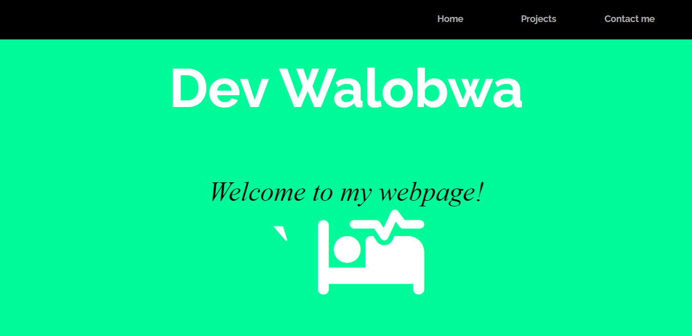

<h1 align="center">PORTFOLIO EXAMPLE</h1>

Learning HTML/CSS with FreeCodeCamp. A project that showcases a good portfolio example (static only)

<h3>Languages and Tools used:</h3>
<a href="https://www.w3.org/html/" target="_blank" rel="noreferrer"> 
